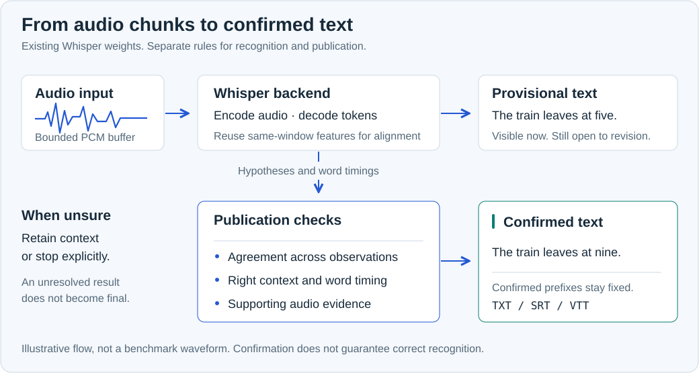
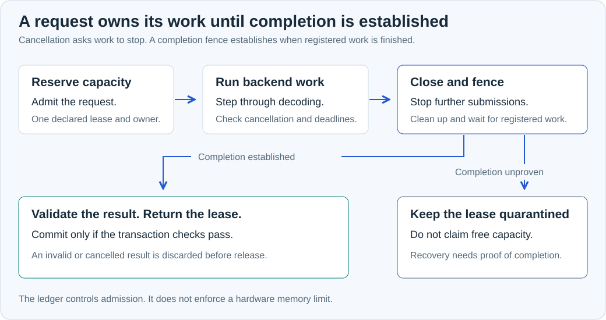

#  Whisper Runtime

Streaming transcription for [OpenAI Whisper](https://github.com/openai/whisper).
Includes a command-line transcriber and a Python API. Uses the original model weights.

[](https://github.com/billmedj/whisper-runtime/actions/workflows/ci.yml)
[](https://github.com/billmedj/whisper-runtime/actions/workflows/native-integration.yml)

**Alpha:** one English audio stream, using `tiny.en`. No GUI yet.

[Install](docs/GETTING_STARTED.md) ·
[Download 0.1.0a1](https://github.com/billmedj/whisper-runtime/releases/tag/v0.1.0a1) ·
[CLI reference](docs/CLI.md) · [Roadmap](docs/ROADMAP.md)

## Transcribe a file

Follow the [setup guide](docs/GETTING_STARTED.md) to install Whisper and the model.
Then run this in the backend's Python environment:

```sh
whisper-runtime speech.wav --setup-manifest .tmp-native-reuse/manifest.json --model PATH/TO/tiny.en.pt --profile low-latency-v2 --txt transcript.txt
```

Input must be mono 16 kHz, 16-bit WAV or raw PCM. Use `--srt` or `--vtt` for
subtitles. Exports are written when the session finishes successfully.

The example selects `low-latency-v2`. Without it, the default
`conservative-v1` can wait about 30 seconds before confirming continuous speech.

You can also try the [model-free example](docs/GETTING_STARTED.md) before
installing Whisper.

## Streaming

Whisper produces preview text as audio arrives. The runtime checks agreement
between passes, word timing and the surrounding audio before confirming text.
Preview text can change; confirmed text stays fixed.



## Control decoding

The Python API lets you:

- Advance decoding one step at a time and cancel work between steps.
- Limit how much work can start at once.
- Save a stream at a supported boundary and resume it in another process.
- Connect to your own WebSocket server for remote transcription.

A resumed stream reprocesses its retained audio; the checkpoint does not contain
a GPU cache. In `low-latency-v2`, word alignment reuses the audio features already
computed for the same window.

<details>
<summary>How requests use capacity</summary>

Each request reserves capacity before it starts. Once the backend finishes and
validation passes, results can be committed. Capacity returns after cleanup.
If completion or cleanup cannot be confirmed, capacity stays reserved.



These limits control which requests can start. They are not hardware RAM limits.
See the [architecture](docs/rfcs/0001-state-resource-execution.md)
and [native adapter](docs/NATIVE_ADAPTER.md).

</details>

## Results

We ran the same 46.55-second audio clip twice on a T4 with `tiny.en`, FP32 and
`low-latency-v2`.

| | Run 1 | Run 2 |
| --- | ---: | ---: |
| First confirmed text | 7.358 s | 6.186 s |
| Longest gap between confirmed-text updates | 7.582 s | 7.679 s |
| Word edits against a 114-word reference | 7 | 7 |

Both runs processed all the audio and produced identical exports. Times start
after initialization and exclude network and display delays. These short tests
do not establish typical accuracy or latency.

[Test report](docs/research/2026-09-07-low-latency-v2-gpu-results.md) ·
[Recorded runs, including failures](evidence/README.md)

## Current limits

Recognition errors are still possible, including in confirmed text. An unresolved
passage can stop a stream. Four-hour endurance, physical microphone capture and
installation on fresh machines still need testing. CPU transcription works, but
we do not promise real-time CPU performance. Translation and multi-channel
support are not part of this alpha.

See [release status](docs/V01_STATUS.md). To report a bug, include the version,
profile, device and error in an [issue](https://github.com/billmedj/whisper-runtime/issues).
Only share audio you have permission to publish.

## Development

The [contribution guide](CONTRIBUTING.md) lists the test commands.
Code lives in `src/whisper_runtime/`; runnable examples are in `examples/`.

The repo includes [backend patches](patches/openai-whisper/README.md),
[checkpoint docs](docs/CHECKPOINTS.md) and [Lean proofs](docs/ASSURANCE.md).
The proofs cover an abstract model, not the full Python or CUDA implementation.
[Upstream contributions](docs/UPSTREAM.md) are tracked separately.

## License

Runtime code: [Apache-2.0](LICENSE). Whisper-derived patches:
[MIT](patches/openai-whisper/LICENSE). Combined package: `Apache-2.0 AND MIT`.
See [third-party notices](THIRD_PARTY_NOTICES.md) and [security reporting](SECURITY.md).

An independent project by [Bilal Medjani](https://github.com/billmedj).
Not affiliated with OpenAI.
